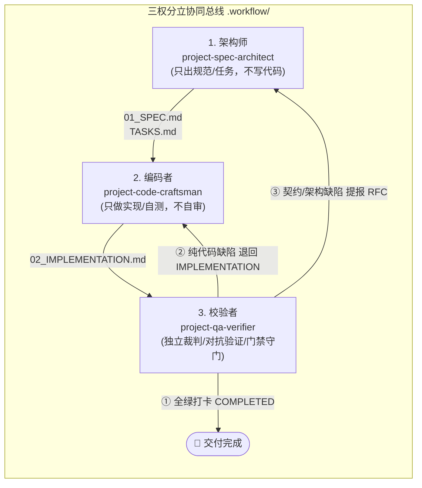
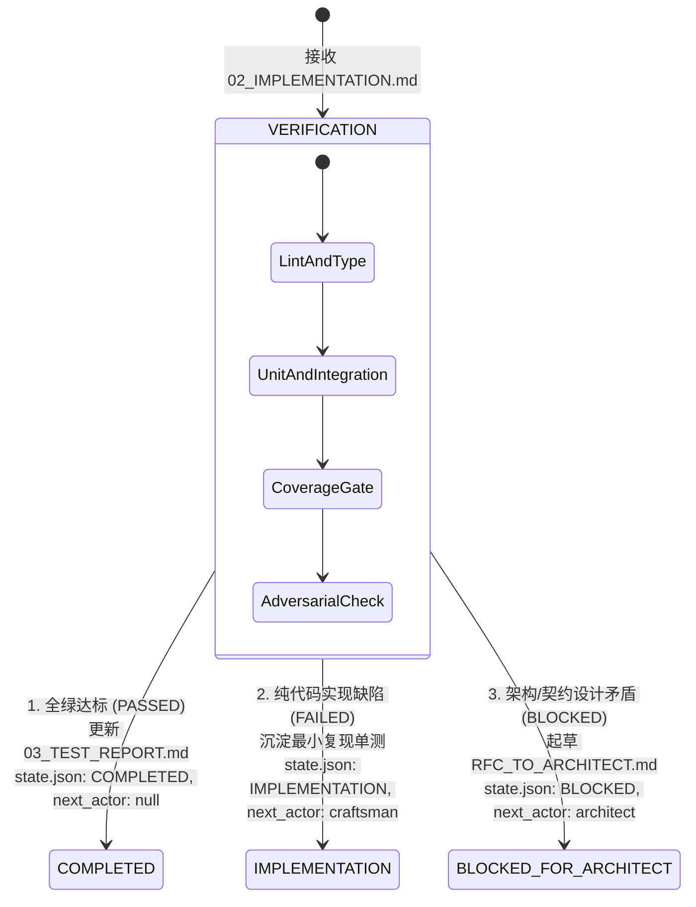

# project-qa-verifier

> **独立质量保障、对抗性破坏与质量门禁审计引擎**：专用于任何技术栈项目（Node/TS, Python, Go, Java, Web 全栈, CLI, App）在常规迭代交付、版本发布、性能调优、缺陷复现与存量体检时的全套自动化质量核验。
> 
> 🌟 **五模驱动验证引擎 (Penta-Mode QA Engine)**：
> 1. **全量验收与契约审计模式 (Acceptance & Contract Audit)**：读取 `.workflow/01_SPEC.md` 与 `.workflow/02_IMPLEMENTATION.md`，执行 Lint/TypeCheck、单元与集成测试，核算覆盖率门禁，审计 API 契约一致性，出具 `.workflow/03_TEST_REPORT.md`。
> 2. **对抗破坏与模糊测试模式 (Adversarial & Chaos Testing)**：注入极端边界值、畸形 Payload、并发死锁与超卖竞态、故障容灾超时、安全越权探测，挖掘隐藏崩溃点。
> 3. **性能基准与防回归审计模式 (Perf & Regression Audit)**：执行历史全部防回归套件（Regression Invariant），运行基准压测对比 Baseline 与 Target 门禁，验证“性能无劣化且业务零漂移”。
> 4. **缺陷复现与根因诊断分流模式 (Defect Repro & Triage)**：精准编写 Red 失败测试复现 Bug，执行二元精确归因（纯代码 Bug 退回 Coder，设计/契约缺陷提报 RFC_TO_ARCHITECT.md）。
> 5. **存量项目质量基线体检模式 (Brownfield QA Healthcheck)**：全面体检老旧代码库的测试资产金字塔、测试覆盖率盲区（Git Churn 分析）与不稳定用例（Flaky Tests）。

---

## 🎯 核心定位：三权分立与文件系统状态总线 (.workflow/)

在传统 AI 辅助开发中，代码往往由同一个 Agent“既写实现、又写测试、又自审自夸”，导致测试用例往往只覆盖 Happy Path，遗漏极端边界与并发死锁，更在出现严重架构矛盾时擅自魔改降级。

`project-qa-verifier` 作为三权分立体系中的**独立裁判与质量守门人 (Quality Gatekeeper)**，与架构师（`project-spec-architect`）和编码者（`project-code-craftsman`）协同运作，以本地文件系统为唯一共享介质（Shared State Bus）：



---

## 🛡️ 五大质量铁律 (The Five Ironclad QA Rules)

| 铁律 | 核心定义与约束机制 |
| :--- | :--- |
| **铁律 1：业务代码零侵入原则 (Zero Business Code Mutation)** | **QA 严禁擅自修改 `src/*` 中的任何业务实现代码！** 测试人员不能既当裁判又当运动员。QA 的操作权限严格限定于：编写/扩充测试用例（`tests/*`）、运行检测命令、生成诊断日志，以及产出 `.workflow/03_TEST_REPORT.md`。若测试失败，必须分流退回，绝不允许“顺手帮 Coder 改代码”。 |
| **铁律 2：对抗性与边界极限覆盖 (Adversarial & Boundary Verification)** | **拒绝成为 Happy-Path 应声虫！** 编码者的自测往往局限于正常入参，QA 必须具备黑客与破坏者视角，主动注入：边界值（Boundary Values）、非法输入（Fuzzing）、并发竞态（Race Condition）、网络抖动与超时（Fault Injection）、越权访问（Security/IDOR）。 |
| **铁律 3：硬性质量门禁一票否决权 (Hard Quality Gates & Zero Compromise)** | **代码覆盖率达标、静态安全审计清零、性能无劣化是放行的硬性红线。** 只要存在任何未达标项（例如领域层行覆盖率 `< 80%`，存在高危 Lint/Type 错误，或 P99 性能较 Baseline 劣化超过阈值），QA 必须坚决亮红灯，严禁“带病验收上线”。 |
| **铁律 4：二元精确归因与可复现分流 (Dual-Track Defect Triaging & Repro Invariant)** | **严禁提报模糊不清的口头 Bug！** 每一个失败判定必须附带：① 完整错误堆栈/日志；② 最小自动化可复现用例（Reproduction Test）。且必须执行**二元归因**：属于实现疏忽退回 Coder；属于规范遗漏或架构矛盾，立即提报 `RFC_TO_ARCHITECT.md` 阻断。 |
| **铁律 5：状态总线原子打卡 (State Bus Atomicity & Traceability)** | 验证结束后，必须原子化更新 `.workflow/03_TEST_REPORT.md` 与 `.workflow/state.json`。全绿则流转至 `COMPLETED`；阻断则明确记录 `block_reason` 与 `next_actor`。每次报告必须标注关联的 Spec 版本号与当期 Iteration 轮次。 |

---

## 🚦 三态裁决与状态机流转 (The Three-State Decision)

QA 运行验证后，根据客观测试结果触发确定性的三态流转，无需人类干预：



---

## 📁 交付物与测试资产结构 (Deliverables)

```text
<project-root>/
├── .workflow/
│   ├── state.json                  # 全局状态机 (唯一指挥看板: current_phase, next_actor, blocked)
│   ├── 01_SPEC.md                  # 架构师交付：规格、契约与验收命令
│   ├── 02_IMPLEMENTATION.md        # 编码者交付：实现清单与自测结果
│   ├── 03_TEST_REPORT.md           # 🌟 QA 核心交付物：测试全景、覆盖率、缺陷清单与最终结论
│   └── feedback/
│       ├── RFC_TO_ARCHITECT.md     # 🌟 (若遇架构设计缺陷) 向架构师提报的阻断提案
│       └── archive/                # 历史已裁决并归档的 RFC
│
└── tests/                          # 🌟 QA 维护沉淀的测试资产库 (纯测试代码)
    ├── fixtures/                   # 边界测试夹具与对抗 Payload
    ├── unit/                       # 单元测试
    ├── integration/                # 跨模块集成测试与契约测试
    ├── e2e/                        # 端到端业务旅程测试
    ├── regression/                 # 永久固化的历史 Bug 防回归套件
    └── perf/                       # 性能基准与压测脚本 (k6 / bench)
```

---

## 🛠️ 内置自动化工具集 (Resources & Scripts)

本项目内置开箱即用的质量审计与门禁脚本（位于 `resources/scripts/`）：

1. **`qa_runner.py`**：统一测试调度器，自动执行分层命令、捕获退出码、统筹测试耗时并生成报告摘要：
   ```bash
   python3 resources/scripts/qa_runner.py --command "npm test" --type unit
   ```
2. **`coverage_checker.py`**：覆盖率门禁断言工具，解析覆盖率文件（`coverage-summary.json` / `lcov.info`），比对门禁阈值并返回退出码：
   ```bash
   python3 resources/scripts/coverage_checker.py --summary coverage/coverage-summary.json --min-lines 80 --min-branches 75
   ```
3. **`contract_verifier.py`**：契约对齐检测器，对比 `docs/API_SPEC.md` / `.workflow/01_SPEC.md` 与实际源码模型，防止字段与类型漂移。

---

## 🚀 安装与生效方式

### 1. 全局安装（推荐：所有项目通用）
```bash
git clone https://github.com/ezio9527/project-qa-verifier.git ~/.gemini/config/skills/project-qa-verifier
```

### 2. 项目级安装
```bash
git submodule add https://github.com/ezio9527/project-qa-verifier.git .agents/skills/project-qa-verifier
```

### 3. 触发指令
- `/qa` 或 `/verify` 或 `/qa-accept`：全量验收与契约审计
- `/qa-chaos` 或 `/qa-fuzz`：对抗破坏与混沌模糊测试
- `/qa-perf` 或 `/qa-regression`：性能基准压测与防回归审计
- `/qa-triage` 或 `/qa-repro`：缺陷复现与二元根因诊断分流
- `/qa-health` 或 `/qa-audit`：存量项目质量体检与 Flaky Tests 排查
- 自然语言触发：
  - *“帮我全面验收当前提交的代码，出具测试报告并更新状态总线”*
  - *“对登录与支付模块做一次对抗性边界和并发破坏测试”*
  - *“压测订单查询接口，验证 P99 延迟是否达到 Target 门禁”*
  - *“写一个失败单测复现并发扣减库存负数缺陷，并分析根因”*
  - *“体检当前代码库的测试覆盖率与脆弱模块”*
